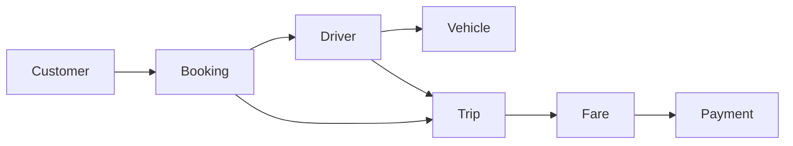
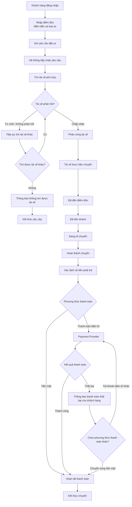
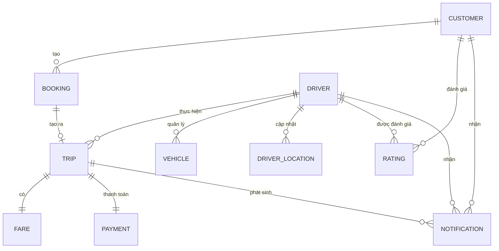
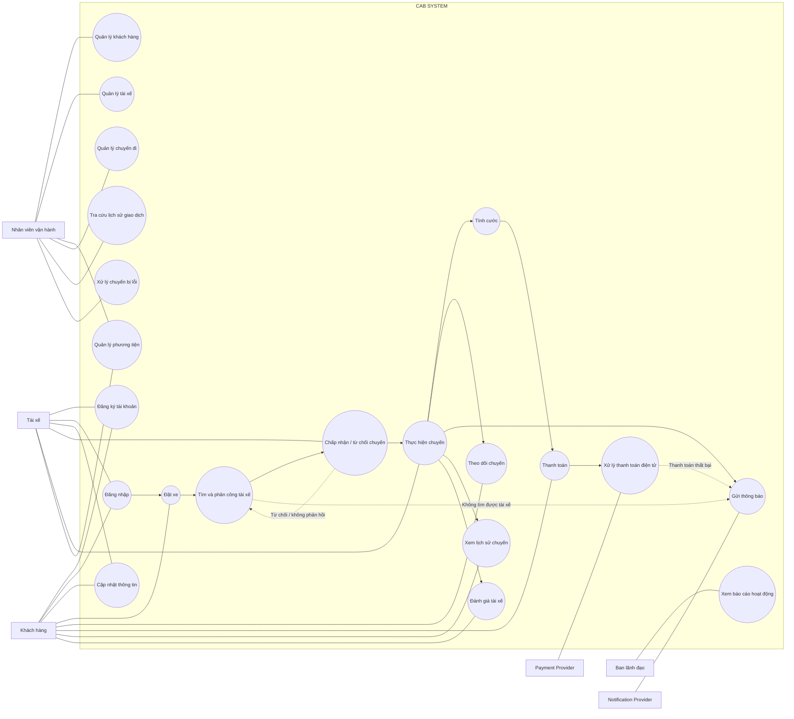

## 1. Xác định Stakeholder

| STT | Stakeholder | Vai trò | Mối quan tâm / Nhu cầu | Mức độ ảnh hưởng |
|---|---|---|---|---|
| 1 | **Customer (Khách hàng)** | Người sử dụng dịch vụ đặt xe | Đặt xe nhanh chóng, theo dõi chuyến đi, biết thông tin tài xế, thanh toán và đánh giá sau chuyến | Cao |
| 2 | **Driver (Tài xế)** | Người cung cấp dịch vụ vận chuyển | Nhận chuyến phù hợp, cập nhật trạng thái chuyến, quản lý hồ sơ/phương tiện và chia sẻ vị trí | Cao |
| 3 | **Operation Staff (Nhân viên vận hành)** | Quản lý và giám sát hoạt động hệ thống | Quản lý khách hàng, tài xế, phương tiện, chuyến đi; xử lý sự cố và tra cứu giao dịch | Cao |
| 4 | **Management (Ban lãnh đạo)** | Quản lý hoạt động kinh doanh | Theo dõi số lượng chuyến, doanh thu, tỷ lệ hoàn thành, tỷ lệ hủy và hiệu quả tài xế | Cao |
| 5 | **Payment Provider** | Hệ thống thanh toán bên ngoài | Xử lý các giao dịch thanh toán điện tử | Trung bình/Cao |
| 6 | **Notification Provider** | Nhà cung cấp dịch vụ thông báo | Gửi thông báo đến khách hàng và tài xế; hỗ trợ mở rộng các kênh thông báo | Trung bình |

## 2.Ma trận Stakeholder – Mức độ ảnh hưởng


# 3. Business Goals – Mục tiêu kinh doanh

| **Mã** | **Mục tiêu kinh doanh** | **Vấn đề/Nghiệp vụ tương ứng** |
|---|---|---|
| **BG01** | Xây dựng nền tảng CAB mới có khả năng phục vụ số lượng lớn khách hàng và tài xế. | Hệ thống hiện tại còn hạn chế về khả năng mở rộng. |
| **BG02** | Giảm sự phụ thuộc vào việc phân công tài xế thủ công. | Phân công tài xế hiện chủ yếu được thực hiện thủ công. |
| **BG03** | Cải thiện khả năng theo dõi chuyến đi của khách hàng. | Khách hàng hiện khó theo dõi trạng thái chuyến đi. |
| **BG04** | Quản lý tập trung hoạt động thanh toán. | Thông tin thanh toán hiện chưa được quản lý tập trung. |
| **BG05** | Nâng cao hiệu quả vận hành và khả năng hỗ trợ xử lý chuyến. | Bộ phận vận hành gặp khó khăn khi quản lý và mở rộng hệ thống. |
| **BG06** | Xây dựng nền tảng có khả năng phát triển thêm tính năng trong tương lai. | Doanh nghiệp muốn bổ sung dịch vụ, phương thức thanh toán và nhà cung cấp thông báo. |
| **BG07** | Đảm bảo hệ thống hoạt động ổn định khi nhu cầu tăng cao. | Hệ thống phải chịu được thời điểm tải cao và lỗi ở một thành phần không làm dừng toàn bộ hệ thống. |
| **BG08** | Bảo vệ dữ liệu và kiểm soát quyền truy cập. | Hệ thống xử lý thông tin cá nhân, vị trí, phương tiện và giao dịch. |


# 4. Xác định phạm vi tối thiểu của hệ thống
##  Business Model tối thiểu

| **Model** | **Bắt buộc** | **Vai trò trong nghiệp vụ** |
|---|:---:|---|
| **Customer** | ✅ | Người tạo yêu cầu đặt xe. |
| **Driver** | ✅ | Người nhận và thực hiện chuyến xe. |
| **Vehicle** | ✅ | Thông tin phương tiện được quản lý cùng với tài xế. |
| **Booking** | ✅ | Đại diện cho yêu cầu đặt xe của khách hàng. |
| **Trip** | ✅ | Đại diện cho chuyến xe được thực hiện. |
| **Fare** | ✅ | Đại diện cho số tiền khách hàng phải trả sau chuyến. |
| **Payment** | ✅ | Đại diện cho việc thanh toán sau khi chuyến hoàn thành. |

## Nghiệp vụ tối thiểu

| **STT** | **Nghiệp vụ** | **Mục đích** |
|:---:|---|---|
| **1** | **Đăng nhập** | Cho phép khách hàng và tài xế xác thực trước khi sử dụng các chức năng yêu cầu tài khoản. |
| **2** | **Tạo yêu cầu đặt xe** | Khách hàng nhập điểm đón, điểm đến, lựa chọn loại xe và gửi yêu cầu đặt xe. |
| **3** | **Tìm và phân công tài xế** | Hệ thống xác định tài xế phù hợp dựa trên vị trí, trạng thái sẵn sàng và tiêu chí vận hành. |
| **4** | **Chấp nhận / từ chối chuyến** | Tài xế phản hồi yêu cầu chuyến; nếu từ chối hoặc không phản hồi, hệ thống tiếp tục tìm tài xế khác. |
| **5** | **Thực hiện chuyến** | Tài xế cập nhật trạng thái từ khi thực hiện chuyến đến khi hoàn thành. |
| **6** | **Xác định số tiền phải trả** | Sau khi chuyến hoàn thành, hệ thống xác định số tiền khách hàng phải trả. |
| **7** | **Thanh toán** | Khách hàng thanh toán bằng tiền mặt hoặc phương thức thanh toán điện tử. |

Đăng nhập → Đặt xe → Tìm & phân công tài xế → Thực hiện chuyến → Hoàn thành → Tính tiền → Thanh toán



# 5. Business Requirements – Yêu cầu nghiệp vụ


| **Mã** | **Business Requirement** | **Nguồn nghiệp vụ** |
|---|---|---|
| **BR01** | Hệ thống phải cho phép khách hàng đăng nhập trước khi sử dụng các chức năng yêu cầu tài khoản. | BS01 |
| **BR02** | Hệ thống phải cho phép khách hàng nhập điểm đón, điểm đến, lựa chọn loại xe và gửi yêu cầu đặt xe. | BS01 |
| **BR03** | Hệ thống phải xác định tài xế phù hợp dựa trên vị trí, trạng thái sẵn sàng và các tiêu chí vận hành. | BS02 |
| **BR04** | Hệ thống phải cho phép tài xế chấp nhận hoặc từ chối yêu cầu chuyến. | BS03, BS04 |
| **BR05** | Khi tài xế từ chối hoặc không phản hồi, hệ thống phải tiếp tục tìm tài xế khác mà không yêu cầu khách hàng tạo lại yêu cầu. | BS04 |
| **BR06** | Nếu không tìm được tài xế, hệ thống phải thông báo rõ ràng cho khách hàng. | BS05 |
| **BR07** | Hệ thống phải cho phép tài xế cập nhật trạng thái trong quá trình thực hiện chuyến đến khi chuyến hoàn thành. | BS06 |
| **BR08** | Hệ thống phải cho phép khách hàng theo dõi trạng thái chuyến đi. | BS03, BS06 |
| **BR09** | Sau khi chuyến hoàn thành, hệ thống phải xác định số tiền khách hàng phải trả dựa trên loại dịch vụ và thông tin chuyến đi. | BS07 |
| **BR10** | Hệ thống phải hỗ trợ thanh toán bằng tiền mặt hoặc phương thức thanh toán điện tử. | BS08 |
| **BR11** | Hệ thống phải tích hợp với nhà cung cấp thanh toán bên ngoài khi khách hàng sử dụng phương thức thanh toán điện tử. | BS08 |
| **BR12** | Hệ thống không được lưu trực tiếp thông tin nhạy cảm của thẻ hoặc tài khoản thanh toán. | BS08 |
| **BR13** | Khi thanh toán điện tử thất bại, hệ thống phải thông báo cho khách hàng và cho phép xử lý lại theo chính sách của doanh nghiệp. | BS09 |
| **BR14** | Hệ thống phải hỗ trợ gửi thông báo cho khách hàng và tài xế khi phát sinh các sự kiện liên quan đến đặt xe, chuyến đi và thanh toán. | BS10 |
| **BR15** | Hệ thống phải cho phép khách hàng xem lịch sử các chuyến đã thực hiện và thông tin liên quan đến chuyến. | BS13 |
| **BR16** | Hệ thống phải cho phép khách hàng đánh giá tài xế sau khi chuyến đi hoàn thành. | BS14 |
| **BR17** | Hệ thống phải hỗ trợ nhân viên vận hành quản lý khách hàng, tài xế, phương tiện, chuyến đi, giao dịch và xử lý các trường hợp chuyến bị lỗi. | BS11 |
| **BR18** | Hệ thống phải cung cấp báo cáo về số lượng chuyến, doanh thu, tỷ lệ hoàn thành, tỷ lệ hủy và hiệu quả hoạt động của tài xế cho ban lãnh đạo. | BS12 |

# 6. Business Scenarios – Tình huống nghiệp vụ

| **Mã** | **Tình huống nghiệp vụ** | **Actor chính** | **Mô tả tình huống** | **Kết quả mong đợi** |
|---|---|---|---|---|
| **BS01** | **Khách hàng đặt xe** | Khách hàng | Khách hàng đăng nhập, nhập điểm đón, điểm đến, chọn loại xe và gửi yêu cầu đặt xe. | Hệ thống tiếp nhận yêu cầu và bắt đầu tìm tài xế. |
| **BS02** | **Hệ thống tìm tài xế phù hợp** | Hệ thống | Hệ thống xác định tài xế phù hợp dựa trên vị trí, trạng thái sẵn sàng và các tiêu chí vận hành. | Tài xế phù hợp được ưu tiên và được đề xuất nhận chuyến. |
| **BS03** | **Tài xế nhận chuyến** | Tài xế | Tài xế nhận được thông báo về chuyến phù hợp và chấp nhận chuyến. | Chuyến được gán cho tài xế và khách hàng biết tài xế đã nhận chuyến. |
| **BS04** | **Tài xế từ chối hoặc không phản hồi** | Tài xế / Hệ thống | Tài xế được đề xuất nhưng từ chối hoặc không phản hồi. | Hệ thống tiếp tục tìm tài xế khác mà khách hàng không phải tạo lại yêu cầu. |
| **BS05** | **Không tìm được tài xế** | Hệ thống | Hệ thống không tìm được tài xế phù hợp cho yêu cầu đặt xe. | Khách hàng được thông báo rõ ràng rằng không tìm được tài xế. |
| **BS06** | **Tài xế thực hiện chuyến** | Tài xế | Tài xế cập nhật trạng thái chuyến trong quá trình thực hiện: đã đến điểm đón, đã đón khách, đang di chuyển và hoàn thành chuyến. | Trạng thái chuyến được cập nhật để khách hàng có thể theo dõi. |
| **BS07** | **Tính cước sau khi hoàn thành chuyến** | Hệ thống | Sau khi chuyến hoàn thành, hệ thống xác định số tiền khách hàng phải trả dựa trên loại dịch vụ và thông tin chuyến đi. | Số tiền phải trả được xác định để thực hiện thanh toán. |
| **BS08** | **Thanh toán điện tử thành công** | Khách hàng / Payment Provider | Khách hàng lựa chọn phương thức thanh toán điện tử và giao dịch được xử lý thông qua nhà cung cấp bên ngoài. | Hệ thống nhận kết quả giao dịch và ghi nhận thanh toán. |
| **BS09** | **Thanh toán điện tử thất bại** | Payment Provider / Hệ thống | Giao dịch thanh toán điện tử không thành công. | Hệ thống thông báo cho khách hàng và cho phép xử lý lại theo chính sách doanh nghiệp. |
| **BS10** | **Gửi thông báo** | Hệ thống / Notification Provider | Hệ thống phát sinh các sự kiện liên quan đến đặt xe, chuyến đi hoặc thanh toán. | Thông báo được gửi đến khách hàng hoặc tài xế tương ứng. |
| **BS11** | **Nhân viên vận hành xử lý hoạt động** | Nhân viên vận hành | Nhân viên vận hành quản lý khách hàng, tài xế, phương tiện, chuyến đi và giao dịch; đồng thời xử lý các trường hợp chuyến bị lỗi. | Hoạt động vận hành được theo dõi và hỗ trợ thông qua hệ thống. |
| **BS12** | **Ban lãnh đạo theo dõi báo cáo** | Ban lãnh đạo | Ban lãnh đạo theo dõi số lượng chuyến, doanh thu, tỷ lệ hoàn thành, tỷ lệ hủy và hiệu quả hoạt động của tài xế. | Các thông tin báo cáo được cung cấp để theo dõi hoạt động hệ thống. |
| **BS13** | **Khách hàng xem lịch sử chuyến** | Khách hàng | Khách hàng truy cập chức năng lịch sử để xem các chuyến đã thực hiện và thông tin liên quan. | Lịch sử chuyến được hiển thị đầy đủ cho khách hàng. |
| **BS14** | **Khách hàng đánh giá tài xế** | Khách hàng | Sau khi chuyến hoàn thành, khách hàng thực hiện đánh giá tài xế. | Đánh giá của khách hàng được hệ thống ghi nhận. |


# 7. Xây dựng mô hình – Quy trình nghiệp vụ




## Mô tả các bước của quy trình

| **STT** | **Bước nghiệp vụ** | **Tác nhân** | **Mô tả** |
|:---:|---|---|---|
| **1** | **Đăng nhập** | Khách hàng | Khách hàng đăng nhập để sử dụng các chức năng yêu cầu tài khoản. |
| **2** | **Nhập thông tin đặt xe** | Khách hàng | Khách hàng nhập điểm đón, điểm đến và lựa chọn loại xe. |
| **3** | **Gửi yêu cầu đặt xe** | Khách hàng | Khách hàng gửi yêu cầu đặt xe đến hệ thống. |
| **4** | **Tiếp nhận yêu cầu** | CAB System | Hệ thống tiếp nhận yêu cầu đặt xe và bắt đầu quá trình tìm tài xế. |
| **5** | **Tìm tài xế phù hợp** | CAB System | Hệ thống xác định tài xế phù hợp dựa trên vị trí, trạng thái sẵn sàng và các tiêu chí vận hành. |
| **6** | **Phản hồi yêu cầu chuyến** | Tài xế | Tài xế nhận thông báo về chuyến và có thể chấp nhận hoặc từ chối chuyến. |
| **7** | **Tìm tài xế khác** | CAB System | Nếu tài xế từ chối hoặc không phản hồi, hệ thống tiếp tục tìm tài xế khác mà không yêu cầu khách hàng tạo lại yêu cầu. |
| **8** | **Thông báo không tìm được tài xế** | CAB System | Nếu không tìm được tài xế phù hợp, hệ thống thông báo rõ ràng cho khách hàng. |
| **9** | **Thực hiện chuyến** | Tài xế | Tài xế thực hiện chuyến và cập nhật trạng thái gồm đã đến điểm đón, đã đón khách và đang di chuyển. |
| **10** | **Hoàn thành chuyến** | Tài xế / CAB System | Tài xế cập nhật trạng thái hoàn thành và hệ thống ghi nhận chuyến đã hoàn tất. |
| **11** | **Xác định số tiền phải trả** | CAB System | Sau khi chuyến hoàn thành, hệ thống xác định số tiền khách hàng phải trả dựa trên loại dịch vụ và thông tin chuyến đi. |
| **12** | **Thanh toán** | Khách hàng | Khách hàng thanh toán bằng tiền mặt hoặc phương thức thanh toán điện tử. |
| **13** | **Xử lý thanh toán điện tử** | Payment Provider | Đối với thanh toán điện tử, giao dịch được xử lý thông qua nhà cung cấp thanh toán bên ngoài. |
| **14** | **Xử lý kết quả thanh toán** | CAB System | Nếu thanh toán thành công, hệ thống ghi nhận kết quả. Nếu thất bại, hệ thống thông báo cho khách hàng và cho phép xử lý lại theo chính sách của doanh nghiệp. |

# 8. Functional Requirements – Yêu cầu chức năng

| **Mã** | **Chức năng** | **Mô tả yêu cầu chức năng** | **Actor chính** | **Business Requirement** |
|---|---|---|---|---|
| **FR01** | Đăng ký tài khoản | Hệ thống phải cho phép khách hàng và tài xế đăng ký tài khoản. Đối với tài xế, nhân viên vận hành cũng có thể tạo tài khoản theo quy trình quản lý tài xế. | Khách hàng / Tài xế / Nhân viên vận hành | BR01 |
| **FR02** | Đăng nhập | Hệ thống phải cho phép khách hàng và tài xế đăng nhập trước khi sử dụng các chức năng yêu cầu tài khoản. | Khách hàng / Tài xế | BR01 |
| **FR03** | Cập nhật thông tin | Hệ thống phải cho phép khách hàng cập nhật thông tin cá nhân; tài xế cập nhật hồ sơ, thông tin phương tiện và trạng thái hoạt động của mình. | Khách hàng / Tài xế | BR01 |
| **FR04** | Nhập điểm đón | Hệ thống phải cho phép khách hàng nhập điểm đón khi tạo yêu cầu đặt xe. | Khách hàng | BR02 |
| **FR05** | Nhập điểm đến | Hệ thống phải cho phép khách hàng nhập điểm đến khi tạo yêu cầu đặt xe. | Khách hàng | BR02 |
| **FR06** | Chọn loại xe | Hệ thống phải cho phép khách hàng lựa chọn loại xe trước khi gửi yêu cầu. | Khách hàng | BR02 |
| **FR07** | Tạo yêu cầu đặt xe | Hệ thống phải tiếp nhận và tạo yêu cầu đặt xe từ thông tin khách hàng cung cấp. | Khách hàng / Hệ thống | BR02 |
| **FR08** | Tìm tài xế phù hợp | Hệ thống phải xác định các tài xế phù hợp dựa trên vị trí, trạng thái sẵn sàng và các tiêu chí vận hành. | Hệ thống | BR03 |
| **FR09** | Ưu tiên tài xế | Hệ thống phải ưu tiên tài xế phù hợp và gần khách hàng. | Hệ thống | BR03 |
| **FR10** | Gửi yêu cầu chuyến | Hệ thống phải gửi yêu cầu chuyến đến tài xế phù hợp. | Hệ thống | BR03 |
| **FR11** | Chấp nhận chuyến | Hệ thống phải cho phép tài xế chấp nhận yêu cầu chuyến. | Tài xế | BR04 |
| **FR12** | Từ chối chuyến | Hệ thống phải cho phép tài xế từ chối yêu cầu chuyến. | Tài xế | BR04 |
| **FR13** | Tìm tài xế tiếp theo | Khi tài xế từ chối hoặc không phản hồi, hệ thống phải tiếp tục tìm tài xế khác mà khách hàng không cần tạo lại yêu cầu. | Hệ thống | BR05 |
| **FR14** | Thông báo không tìm được tài xế | Khi không tìm được tài xế, hệ thống phải thông báo rõ ràng cho khách hàng. | Hệ thống | BR06 |
| **FR15** | Cập nhật trạng thái chuyến | Hệ thống phải cho phép tài xế cập nhật trạng thái chuyến trong quá trình thực hiện. | Tài xế | BR07 |
| **FR16** | Theo dõi trạng thái chuyến | Hệ thống phải cho phép khách hàng theo dõi trạng thái hiện tại của chuyến. | Khách hàng | BR08 |
| **FR17** | Cập nhật vị trí tài xế | Hệ thống phải lưu thông tin vị trí của tài xế để hỗ trợ việc tìm tài xế gần khách hàng và dự kiến thời gian đến. | Tài xế / Hệ thống | BR03, BR08 |
| **FR18** | Xác định số tiền phải trả | Sau khi chuyến hoàn thành, hệ thống phải xác định số tiền khách hàng phải trả dựa trên loại dịch vụ và thông tin chuyến đi. | Hệ thống | BR09 |
| **FR19** | Thanh toán tiền mặt | Hệ thống phải hỗ trợ khách hàng thanh toán bằng tiền mặt. | Khách hàng | BR10 |
| **FR20** | Thanh toán điện tử | Hệ thống phải hỗ trợ khách hàng thanh toán bằng phương thức điện tử. | Khách hàng | BR10 |
| **FR21** | Tích hợp thanh toán | Hệ thống phải tích hợp với nhà cung cấp thanh toán bên ngoài để xử lý thanh toán điện tử. | Hệ thống / Payment Provider | BR11 |
| **FR22** | Bảo vệ dữ liệu thanh toán | Hệ thống không được lưu trực tiếp thông tin nhạy cảm của thẻ hoặc tài khoản thanh toán. | Hệ thống | BR12 |
| **FR23** | Xử lý thanh toán thất bại | Khi giao dịch thanh toán điện tử thất bại, hệ thống phải thông báo cho khách hàng và cho phép xử lý lại theo chính sách của doanh nghiệp. | Hệ thống | BR13 |
| **FR24** | **Gửi thông báo** | Hệ thống phải gửi thông báo cho khách hàng và tài xế khi có các sự kiện liên quan đến đặt xe, chuyến đi và thanh toán. | Hệ thống | BR14 |
| **FR25** | **Xem lịch sử chuyến** | Hệ thống phải cho phép khách hàng xem lịch sử các chuyến đã thực hiện và thông tin liên quan đến chuyến. | Khách hàng | BR15 |
| **FR26** | **Đánh giá tài xế** | Hệ thống phải cho phép khách hàng đánh giá tài xế sau khi chuyến đi hoàn thành. | Khách hàng | BR16 |
| **FR27** | Quản lý phương tiện | Hệ thống phải cho phép tài xế cập nhật thông tin phương tiện của mình và cho phép nhân viên vận hành xem, cập nhật và quản lý thông tin phương tiện trong hệ thống. | Tài xế / Nhân viên vận hành | BR17 |
| **FR28** | **Quản lý khách hàng** | Hệ thống phải cho phép nhân viên vận hành xem và quản lý thông tin khách hàng. | Nhân viên vận hành | BR17 |
| **FR29** | **Quản lý tài xế** | Hệ thống phải cho phép nhân viên vận hành xem và quản lý thông tin tài xế. | Nhân viên vận hành | BR17 |
| **FR30** | **Quản lý chuyến đi** | Hệ thống phải cho phép nhân viên vận hành theo dõi và quản lý các chuyến đi trong hệ thống. | Nhân viên vận hành | BR17 |
| **FR31** | **Tra cứu giao dịch** | Hệ thống phải cho phép nhân viên vận hành tra cứu thông tin các giao dịch thanh toán. | Nhân viên vận hành | BR17 |
| **FR32** | **Xử lý chuyến lỗi** | Hệ thống phải cho phép nhân viên vận hành tiếp nhận và xử lý các trường hợp chuyến đi phát sinh lỗi. | Nhân viên vận hành | BR17 |
| **FR33** | **Xem báo cáo hoạt động** | Hệ thống phải cho phép ban lãnh đạo xem báo cáo về số lượng chuyến, doanh thu, tỷ lệ hoàn thành, tỷ lệ hủy và hiệu quả hoạt động của tài xế. | Ban lãnh đạo | BR18 |
# 9. Business Rules và Business Exceptions

## 9.1. Business Rules – Quy định nghiệp vụ


| **Mã** | **Quy định nghiệp vụ** | **Mô tả** |
|---|---|---|
| **BRL01** | **Xác thực người dùng** | Khách hàng và tài xế phải được xác thực trước khi sử dụng các chức năng yêu cầu tài khoản. |
| **BRL02** | **Điều kiện tài xế nhận chuyến** | Tài xế phải ở trạng thái sẵn sàng nhận chuyến khi được hệ thống đề xuất cho yêu cầu phù hợp. |
| **BRL03** | **Tiêu chí tìm tài xế** | Hệ thống xác định tài xế phù hợp dựa trên vị trí, trạng thái sẵn sàng và các tiêu chí vận hành khác. |
| **BRL04** | **Ưu tiên tài xế** | Hệ thống ưu tiên tài xế phù hợp và gần khách hàng. |
| **BRL05** | **Tài xế từ chối chuyến** | Khi tài xế từ chối chuyến, hệ thống phải tiếp tục tìm tài xế khác mà khách hàng không phải tạo lại yêu cầu. |
| **BRL06** | **Tài xế không phản hồi** | Khi tài xế được đề xuất nhưng không phản hồi, hệ thống phải tiếp tục tìm tài xế khác. |
| **BRL07** | **Không tìm được tài xế** | Khi không tìm được tài xế phù hợp, hệ thống phải thông báo rõ ràng cho khách hàng. |
| **BRL08** | **Cập nhật trạng thái chuyến** | Trong quá trình thực hiện chuyến, tài xế phải cập nhật các trạng thái theo yêu cầu của hệ thống: đã đến điểm đón, đã đón khách, đang di chuyển và hoàn thành chuyến. |
| **BRL09** | **Lưu vị trí tài xế** | Hệ thống lưu thông tin vị trí của tài xế để hỗ trợ tìm tài xế gần khách hàng và cải thiện khả năng dự kiến thời gian đến. |
| **BRL10** | **Thời điểm tính tiền** | Sau khi chuyến đi hoàn thành, hệ thống xác định số tiền khách hàng phải trả dựa trên loại dịch vụ và thông tin chuyến đi. |
| **BRL11** | **Phương thức thanh toán** | Khách hàng có thể thanh toán bằng tiền mặt hoặc phương thức thanh toán điện tử. |
| **BRL12** | **Thanh toán điện tử** | Thanh toán điện tử phải được thực hiện thông qua nhà cung cấp thanh toán bên ngoài. |
| **BRL13** | **Bảo vệ thông tin thanh toán** | Hệ thống CAB không được lưu trực tiếp thông tin nhạy cảm của thẻ hoặc tài khoản thanh toán. |
| **BRL14** | **Xử lý thanh toán thất bại** | Khi giao dịch thanh toán điện tử thất bại, hệ thống phải thông báo cho khách hàng và cho phép xử lý lại theo chính sách của doanh nghiệp. |
| **BRL15** | **Thông báo sự kiện** | Hệ thống phải hỗ trợ thông báo cho khách hàng và tài xế tại các sự kiện liên quan đến yêu cầu đặt xe, chuyến đi và thanh toán. |
| **BRL16** | **Phân quyền quản trị** | Các thao tác quản trị phải được kiểm soát quyền truy cập; nhân viên thông thường không được thực hiện các thao tác nhạy cảm khi không có quyền. |
| **BRL17** | **Bảo vệ dữ liệu** | Thông tin cá nhân, thông tin phương tiện, dữ liệu vị trí và dữ liệu giao dịch phải được bảo vệ. |
| **BRL18** | **Lưu vết thao tác** | Các thao tác quan trọng phải được lưu vết để phục vụ kiểm tra khi có sự cố. |
| **BRL19** | **Khả năng hoạt động độc lập** | Lỗi xảy ra ở chức năng thanh toán hoặc thông báo không được làm toàn bộ hệ thống đặt xe ngừng hoạt động. |
| **BRL20** | **Khả năng mở rộng** | Các thành phần của hệ thống phải có khả năng mở rộng độc lập khi tải tăng. |
| **BRL21** | **Triển khai từng phần** | Các chức năng mới phải có khả năng được triển khai từng phần với mức ảnh hưởng hạn chế đến các chức năng đang hoạt động. |
| **BRL22** | **Khả năng mở rộng dịch vụ** | Hệ thống phải có kiến trúc linh hoạt để có thể bổ sung loại dịch vụ mới, phương thức thanh toán mới hoặc nhà cung cấp thông báo mới mà không phải xây dựng lại toàn bộ hệ thống. |


## 9.2. Business Exceptions – Các trường hợp ngoại lệ

| **Mã** | **Ngoại lệ** | **Điều kiện xảy ra** | **Cách xử lý theo yêu cầu** |
|---|---|---|---|
| **EX01** | **Tài xế từ chối chuyến** | Tài xế không chấp nhận yêu cầu chuyến. | Hệ thống tiếp tục tìm tài xế khác. |
| **EX02** | **Tài xế không phản hồi** | Tài xế được đề xuất nhưng không phản hồi. | Hệ thống tiếp tục tìm tài xế khác. |
| **EX03** | **Không tìm được tài xế** | Không có tài xế phù hợp để nhận chuyến. | Thông báo rõ ràng cho khách hàng. |
| **EX04** | **Thanh toán điện tử thất bại** | Giao dịch thanh toán điện tử không thành công. | Thông báo cho khách hàng và cho phép xử lý lại theo chính sách doanh nghiệp. |
| **EX05** | **Lỗi chức năng thanh toán** | Thành phần thanh toán xảy ra lỗi. | Lỗi thanh toán không được làm toàn bộ hệ thống đặt xe ngừng hoạt động. |
| **EX06** | **Lỗi chức năng thông báo** | Thành phần thông báo xảy ra lỗi. | Lỗi thông báo không được làm toàn bộ hệ thống đặt xe ngừng hoạt động. |

---

## 9.3. Các tình huống chưa được chốt

| **Mã** | **Nội dung cần làm rõ** | **Trạng thái** |
|---|---|---|
| **OQ01** | Cách tính cước cụ thể. | Chưa chốt |
| **OQ02** | Tiêu chí cụ thể để ưu tiên tài xế. | Chưa chốt |
| **OQ03** | Thời gian tài xế phải phản hồi. | Chưa chốt |
| **OQ04** | Chính sách hủy chuyến. | Chưa chốt |
| **OQ05** | Cách xử lý khi mất kết nối mạng. | Chưa chốt |
| **OQ06** | Thời gian lưu trữ dữ liệu. | Chưa chốt |

> **Nguyên tắc BA:** Không tự xác định giá trị hoặc quy tắc cho các nội dung OQ01–OQ06 khi chưa có xác nhận từ khách hàng.
# 10. Non-Functional Requirements – Yêu cầu phi chức năng

| **Mã** | **Nhóm** | **Yêu cầu phi chức năng** | **Mô tả** |
|---|---|---|---|
| **NFR01** | **Ổn định** | Hệ thống phải hoạt động ổn định khi nhu cầu tăng cao. | Đảm bảo hệ thống vẫn hoạt động khi số lượng khách hàng và tài xế tăng hoặc nhu cầu đặt xe tăng cao. |
| **NFR02** | **Độ tin cậy** | Lỗi tại chức năng thanh toán hoặc thông báo không được làm toàn bộ hệ thống đặt xe ngừng hoạt động. | Sự cố tại một thành phần không được làm gián đoạn toàn bộ dịch vụ đặt xe. |
| **NFR03** | **Khả năng mở rộng** | Các thành phần của hệ thống phải có khả năng mở rộng độc lập khi tải tăng. | Cho phép mở rộng từng thành phần khi nhu cầu sử dụng tăng. |
| **NFR04** | **Khả năng triển khai** | Các chức năng mới có thể được triển khai từng phần với mức ảnh hưởng hạn chế đến các chức năng đang hoạt động. | Hạn chế ảnh hưởng đến các chức năng hiện có khi triển khai thay đổi. |
| **NFR05** | **Bảo mật dữ liệu** | Hệ thống phải bảo vệ thông tin cá nhân, thông tin phương tiện, dữ liệu vị trí và dữ liệu giao dịch. | Ngăn ngừa việc truy cập trái phép đối với các dữ liệu được hệ thống xử lý. |
| **NFR06** | **Xác thực** | Khách hàng và tài xế phải được xác thực trước khi sử dụng các chức năng yêu cầu tài khoản. | Chỉ người dùng đã được xác thực mới được sử dụng các chức năng yêu cầu tài khoản. |
| **NFR07** | **Phân quyền** | Các thao tác quản trị phải được kiểm soát quyền truy cập. | Nhân viên thông thường không được thực hiện các thao tác nhạy cảm khi không có quyền. |
| **NFR08** | **Lưu vết** | Hệ thống phải lưu vết các thao tác quan trọng. | Dữ liệu lưu vết phục vụ kiểm tra khi xảy ra sự cố. |
| **NFR09** | **Khả năng mở rộng dịch vụ** | Hệ thống phải có kiến trúc đủ linh hoạt để bổ sung các loại dịch vụ mới. | Có thể bổ sung dịch vụ mới mà không phải xây dựng lại toàn bộ ứng dụng. |
| **NFR10** | **Khả năng mở rộng thanh toán** | Hệ thống phải cho phép bổ sung thêm phương thức thanh toán. | Có thể bổ sung phương thức thanh toán mới trong tương lai. |
| **NFR11** | **Khả năng thay đổi nhà cung cấp thông báo** | Hệ thống phải cho phép bổ sung hoặc thay đổi nhà cung cấp thông báo. | Việc thay đổi nhà cung cấp thông báo không yêu cầu xây dựng lại toàn bộ ứng dụng. |
| **NFR12** | **Khả năng thay đổi kỹ thuật** | Hệ thống phải cho phép thay đổi một số thành phần kỹ thuật mà không phải xây dựng lại toàn bộ ứng dụng. | Đảm bảo kiến trúc linh hoạt khi cần thay đổi các thành phần kỹ thuật. |

# 11. Xác định thực thể ERD

## 11.1. Danh sách thực thể

| **STT** | **Thực thể** | **Mô tả nghiệp vụ** |
|:---:|---|---|
| **1** | **Customer** | Lưu thông tin khách hàng sử dụng hệ thống để đặt xe, theo dõi chuyến, thanh toán và đánh giá tài xế. |
| **2** | **Driver** | Lưu thông tin tài xế, hồ sơ và trạng thái hoạt động để nhận và thực hiện chuyến. |
| **3** | **Vehicle** | Lưu thông tin phương tiện của tài xế. |
| **4** | **Booking** | Lưu thông tin yêu cầu đặt xe do khách hàng tạo, gồm điểm đón, điểm đến và loại xe. |
| **5** | **Trip** | Lưu thông tin chuyến đi sau khi yêu cầu được tài xế nhận và trong quá trình thực hiện. |
| **6** | **DriverLocation** | Lưu thông tin vị trí của tài xế phục vụ tìm tài xế gần khách hàng và hỗ trợ dự kiến thời gian đến. |
| **7** | **Fare** | Lưu thông tin số tiền khách hàng phải trả sau khi chuyến hoàn thành. |
| **8** | **Payment** | Lưu thông tin và kết quả giao dịch thanh toán của chuyến đi. |
| **9** | **Notification** | Lưu thông tin các thông báo liên quan đến yêu cầu đặt xe, chuyến đi và thanh toán. |
| **10** | **Rating** | Lưu thông tin đánh giá của khách hàng đối với tài xế sau khi chuyến hoàn thành. |

##  Quan hệ giữa các thực thể

| **Quan hệ** | **Cardinality** | **Ý nghĩa nghiệp vụ** |
|---|:---:|---|
| **Customer → Booking** | 1 : N | Một khách hàng có thể tạo nhiều yêu cầu đặt xe. |
| **Booking → Trip** | 1 : 0..1 | Một yêu cầu đặt xe có thể chưa tạo chuyến hoặc tạo một chuyến. |
| **Driver → Trip** | 1 : N | Một tài xế có thể thực hiện nhiều chuyến. |
| **Driver → Vehicle** | 1 : N | Một tài xế có thể có nhiều thông tin phương tiện được quản lý. |
| **Driver → DriverLocation** | 1 : N | Một tài xế có thể có nhiều thông tin vị trí được lưu trong quá trình hoạt động. |
| **Trip → Fare** | 1 : 1 | Mỗi chuyến đi có một thông tin cước tương ứng. |
| **Trip → Payment** | 1 : 1 | Mỗi chuyến đi có một thông tin thanh toán tương ứng. |
| **Customer → Rating** | 1 : N | Một khách hàng có thể thực hiện nhiều đánh giá. |
| **Driver → Rating** | 1 : N | Một tài xế có thể nhận nhiều đánh giá từ khách hàng. |
| **Customer → Notification** | 1 : N | Một khách hàng có thể nhận nhiều thông báo. |
| **Driver → Notification** | 1 : N | Một tài xế có thể nhận nhiều thông báo. |
| **Trip → Notification** | 1 : N | Một chuyến đi có thể phát sinh nhiều thông báo trong quá trình xử lý. |

##  ERD ở mức khái niệm


## Phạm vi ERD tối thiểu

```text
Customer
   ↓
Booking
   ↓
Trip
   ↓
Fare
   ↓
Payment

Driver ─────→ Trip
Driver ─────→ Vehicle

```


# 13. Thiết kế Use Case

## 13.1. Mục tiêu

Use Case Model mô tả các chức năng mà hệ thống CAB cung cấp và cách các Actor tương tác với hệ thống để thực hiện các nghiệp vụ.

Thiết kế Use Case được xây dựng dựa trên các Functional Requirements đã xác định và tập trung vào các nghiệp vụ được nêu trong tình huống.

---

## 13.2. Xác định Actor

| **Actor** | **Vai trò** |
|---|---|
| **Khách hàng (Customer)** | Đăng ký, đăng nhập, đặt xe, theo dõi chuyến, xem lịch sử, thanh toán và đánh giá tài xế. |
| **Tài xế (Driver)** | Quản lý hồ sơ, phương tiện, trạng thái hoạt động, nhận/từ chối chuyến và cập nhật trạng thái chuyến. |
| **Nhân viên vận hành (Operation Staff)** | Quản lý khách hàng, tài xế, phương tiện, chuyến đi, giao dịch và xử lý các trường hợp chuyến bị lỗi. |
| **Ban lãnh đạo (Management)** | Theo dõi các báo cáo về số lượng chuyến, doanh thu, tỷ lệ hoàn thành, tỷ lệ hủy và hiệu quả hoạt động của tài xế. |
| **Payment Provider** | Xử lý giao dịch thanh toán điện tử cho CAB System. |
| **Notification Provider** | Cung cấp kênh gửi thông báo cho khách hàng và tài xế. |

---

## 13.3. Danh sách Use Case

| UC | Tên Use Case | Actor |
|---|---|---|
| UC01 | Đăng ký tài khoản | Khách hàng / Tài xế |
| UC02 | Đăng nhập | Khách hàng / Tài xế |
| UC03 | Cập nhật thông tin | Khách hàng / Tài xế |
| UC04 | Đặt xe | Khách hàng |
| UC05 | Tìm và phân công tài xế | Hệ thống |
| UC06 | Chấp nhận / từ chối chuyến | Tài xế |
| UC07 | Theo dõi chuyến | Khách hàng |
| UC08 | Thực hiện chuyến | Tài xế |
| UC09 | Tính cước | Hệ thống |
| UC10 | Thanh toán | Khách hàng |
| UC11 | Xử lý thanh toán điện tử | Payment Provider |
| UC12 | Gửi thông báo | Notification Provider |
| UC13 | Xem lịch sử chuyến | Khách hàng |
| UC14 | Đánh giá tài xế | Khách hàng |
| UC15 | Quản lý khách hàng | Nhân viên vận hành |
| UC16 | Quản lý tài xế | Nhân viên vận hành |
| UC17 | Quản lý phương tiện | Tài xế / Nhân viên vận hành |
| UC18 | Quản lý chuyến đi | Nhân viên vận hành |
| UC19 | Tra cứu lịch sử giao dịch | Nhân viên vận hành |
| UC20 | Xử lý chuyến bị lỗi | Nhân viên vận hành |
| UC21 | Xem báo cáo hoạt động | Ban lãnh đạo |

---


## 13.4. Use Case Diagram tổng quát


## 13.5. Quan hệ giữa các Use Case cốt lõi

Quy trình đặt xe được thực hiện theo chuỗi Use Case chính:

```text
UC02 – Đăng nhập
        ↓
UC04 – Đặt xe
        ↓
UC05 – Tìm và phân công tài xế
        ↓
UC06 – Chấp nhận / từ chối chuyến
        ↓
UC08 – Thực hiện chuyến
        ↓
UC09 – Tính cước
        ↓
UC10 – Thanh toán
```

**UC07 – Theo dõi chuyến** được thực hiện song song trong quá trình chuyến đi diễn ra để khách hàng theo dõi trạng thái hiện tại của chuyến.

### Các trường hợp ngoại lệ

```text
UC06 – Tài xế từ chối / không phản hồi
        ↓
UC05 – Tìm và phân công tài xế
        ↓
Có tài xế phù hợp?
    ├── Có → Gửi yêu cầu cho tài xế tiếp theo
    └── Không → UC12 Gửi thông báo cho khách hàng


UC10 – Thanh toán
        ↓
Thanh toán điện tử
        ↓
UC11 – Xử lý thanh toán điện tử
        ↓
Thanh toán thất bại
        ↓
UC12 – Gửi thông báo
        ↓
Xử lý lại theo chính sách doanh nghiệp
```

## 13.6. Mối liên hệ giữa Use Case và Actor

| **Actor** | **Use Case chính** |
|---|---|
| **Khách hàng** | Đăng ký tài khoản, Đăng nhập, Cập nhật thông tin, Đặt xe, Theo dõi chuyến, Thanh toán, Xem lịch sử chuyến, Đánh giá tài xế |
| **Tài xế** | Đăng ký tài khoản, Đăng nhập, Cập nhật thông tin, Chấp nhận/Từ chối chuyến, Thực hiện chuyến |
| **Nhân viên vận hành** | Quản lý khách hàng, Quản lý tài xế, Quản lý phương tiện, Quản lý chuyến đi, Tra cứu giao dịch, Xử lý chuyến bị lỗi |
| **Ban lãnh đạo** | Xem báo cáo hoạt động |
| **Payment Provider** | Xử lý thanh toán điện tử |
| **Notification Provider** | Cung cấp dịch vụ thông báo |

---

## 13.7. Quan hệ Include / Extend

Trong Use Case Diagram tổng quát, các mũi tên giữa các Use Case **không được sử dụng để biểu diễn trình tự nghiệp vụ**. Trình tự được mô tả riêng tại mục 12.5.

Các quan hệ `include/extend` được hiểu như sau:

### UC04 – Đặt xe

UC04 bao gồm các chức năng bắt buộc:

```text
UC04 – Đặt xe
    ├── Nhập điểm đón
    ├── Nhập điểm đến
    └── Chọn loại xe
```

Tương ứng với **FR04, FR05, FR06, FR07**.

### UC05 – Tìm và phân công tài xế

UC05 bao gồm:

```text
UC05 – Tìm và phân công tài xế
    ├── Xác định tài xế phù hợp
    ├── Ưu tiên tài xế phù hợp
    ├── Gửi yêu cầu chuyến
    ├── Tìm tài xế tiếp theo
    └── Thông báo khi không tìm được tài xế
```

Tương ứng với **FR08, FR09, FR10, FR13, FR14, FR17**.

### UC10 – Thanh toán

UC10 hỗ trợ hai phương thức:

```text
UC10 – Thanh toán
    ├── Thanh toán tiền mặt
    └── Thanh toán điện tử
            ↓
      UC11 – Xử lý thanh toán điện tử
```

Tương ứng với **FR19, FR20, FR21, FR22, FR23**.

> **Lưu ý:** Các nội dung trên mô tả phạm vi/chức năng con của Use Case. Khi vẽ UML chính thức, chỉ sử dụng `<<include>>` hoặc `<<extend>>` khi có quan hệ UML thực sự; không dùng các quan hệ này để biểu diễn thứ tự thực hiện nghiệp vụ.

---

## 13.8. Use Case trọng tâm


| **Mã** | **Use Case** | **Mức độ quan trọng** |
|---|---|:---:|
| **UC04** | Đặt xe | Cao |
| **UC05** | Tìm và phân công tài xế | Rất cao |
| **UC06** | Chấp nhận / từ chối chuyến | Cao |
| **UC08** | Thực hiện chuyến | Cao |
| **UC09** | Tính cước | Cao |
| **UC10** | Thanh toán | Rất cao |

Trong đó **UC05 – Tìm và phân công tài xế** là Use Case có nhiều nhánh nghiệp vụ nhất vì phải xử lý trường hợp tài xế chấp nhận, từ chối, không phản hồi và trường hợp không tìm được tài xế.

---

## 13.9. Traceability giữa Use Case và Functional Requirements

| Use Case | Functional Requirements |
|---|---|
| UC01 – Đăng ký tài khoản | FR01 |
| UC02 – Đăng nhập | FR02 |
| UC03 – Cập nhật thông tin | FR03 |
| UC04 – Đặt xe | FR04, FR05, FR06, FR07 |
| UC05 – Tìm và phân công tài xế | FR08, FR09, FR10, FR13, FR14, FR17 |
| UC06 – Chấp nhận / từ chối chuyến | FR11, FR12 |
| UC07 – Theo dõi chuyến | FR16, FR17 |
| UC08 – Thực hiện chuyến | FR15 |
| UC09 – Tính cước | FR18 |
| UC10 – Thanh toán | FR19, FR20 |
| UC11 – Xử lý thanh toán điện tử | FR21, FR22, FR23 |
| UC12 – Gửi thông báo | FR24 |
| UC13 – Xem lịch sử chuyến | FR25 |
| UC14 – Đánh giá tài xế | FR26 |
| UC15 – Quản lý khách hàng | FR28 |
| UC16 – Quản lý tài xế | FR29 |
| UC17 – Quản lý phương tiện | FR27 |
| UC18 – Quản lý chuyến đi | FR30 |
| UC19 – Tra cứu lịch sử giao dịch | FR31 |
| UC20 – Xử lý chuyến bị lỗi | FR32 |
| UC21 – Xem báo cáo hoạt động | FR33 |

## 13.10. Phạm vi Use Case

### Core Use Cases

```text
Đăng nhập
Đặt xe
Tìm và phân công tài xế
Chấp nhận / từ chối chuyến
Thực hiện chuyến
Tính cước
Thanh toán
```

### Supporting Use Cases

```text
Cập nhật thông tin
Quản lý phương tiện
Theo dõi chuyến
Thông báo
Xem lịch sử
Đánh giá
```

### Management Use Cases

```text
Quản lý khách hàng
Quản lý tài xế
Quản lý phương tiện
Quản lý chuyến đi
Tra cứu giao dịch
Xử lý chuyến lỗi
Xem báo cáo
```

---

# 14. Acceptance Criteria (AC) – Tiêu chí chấp nhận


| **Mã AC** | **Chức năng / Yêu cầu** | **Tiêu chí chấp nhận** |
|---|---|---|
| **AC01** | Đăng ký tài khoản | Khách hàng hoặc tài xế có thể đăng ký tài khoản thành công; đối với tài xế, nhân viên vận hành cũng có thể tạo tài khoản theo quy trình quản lý tài xế. |
| **AC02** | Đăng nhập | Khi cung cấp thông tin đăng nhập hợp lệ, khách hàng hoặc tài xế có thể đăng nhập và sử dụng các chức năng yêu cầu tài khoản. |
| **AC03** | Cập nhật thông tin | Khách hàng có thể cập nhật thông tin cá nhân; tài xế có thể cập nhật hồ sơ, thông tin phương tiện và trạng thái hoạt động của mình; hệ thống ghi nhận thông tin cập nhật. |
| **AC04** | Tạo yêu cầu đặt xe | Khách hàng có thể nhập điểm đón, điểm đến, lựa chọn loại xe và gửi yêu cầu đặt xe thành công. |
| **AC05** | Tiếp nhận yêu cầu đặt xe | Sau khi khách hàng gửi yêu cầu, hệ thống ghi nhận yêu cầu và bắt đầu quá trình tìm tài xế. |
| **AC06** | Tìm tài xế phù hợp | Hệ thống xác định tài xế dựa trên vị trí, trạng thái sẵn sàng và các tiêu chí vận hành được xác định. |
| **AC07** | Ưu tiên tài xế | Hệ thống ưu tiên tài xế phù hợp và gần khách hàng trong quá trình tìm kiếm. |
| **AC08** | Tài xế chấp nhận chuyến | Khi tài xế chấp nhận yêu cầu, hệ thống ghi nhận tài xế đã nhận chuyến và phân công tài xế cho yêu cầu. |
| **AC09** | Tài xế từ chối chuyến | Khi tài xế từ chối, hệ thống không yêu cầu khách hàng tạo lại yêu cầu và tiếp tục tìm tài xế khác. |
| **AC10** | Tài xế không phản hồi | Khi tài xế không phản hồi, hệ thống tiếp tục tìm tài xế khác mà không yêu cầu khách hàng tạo lại yêu cầu. |
| **AC11** | Không tìm được tài xế | Khi không tìm được tài xế phù hợp, hệ thống thông báo rõ ràng cho khách hàng. |
| **AC12** | Theo dõi chuyến | Khách hàng có thể xem trạng thái hiện tại của chuyến và biết thông tin tài xế đã nhận chuyến. |
| **AC13** | Cập nhật trạng thái chuyến | Tài xế có thể cập nhật trạng thái chuyến theo quá trình thực hiện: đã đến điểm đón, đã đón khách, đang di chuyển và hoàn thành chuyến. |
| **AC14** | Cập nhật vị trí tài xế | Hệ thống lưu thông tin vị trí tài xế để hỗ trợ tìm tài xế gần khách hàng và cải thiện khả năng dự kiến thời gian đến. |
| **AC15** | Hoàn thành chuyến | Khi tài xế cập nhật trạng thái hoàn thành, hệ thống ghi nhận chuyến đã hoàn thành và chuyển sang bước xác định số tiền phải trả. |
| **AC16** | Tính cước | Sau khi chuyến hoàn thành, hệ thống xác định số tiền khách hàng phải trả dựa trên loại dịch vụ và thông tin chuyến đi. |
| **AC17** | Thanh toán tiền mặt | Khách hàng có thể lựa chọn thanh toán bằng tiền mặt và hệ thống ghi nhận phương thức thanh toán tương ứng. |
| **AC18** | Thanh toán điện tử | Khách hàng có thể lựa chọn thanh toán điện tử và giao dịch được chuyển đến nhà cung cấp thanh toán bên ngoài. |
| **AC19** | Thanh toán điện tử thành công | Khi nhà cung cấp thanh toán trả về kết quả thành công, hệ thống ghi nhận kết quả thanh toán và hoàn tất quá trình thanh toán. |
| **AC20** | Thanh toán điện tử thất bại | Khi giao dịch thất bại, hệ thống thông báo cho khách hàng và cho phép xử lý lại theo chính sách của doanh nghiệp. |
| **AC21** | Bảo vệ dữ liệu thanh toán | Hệ thống không lưu trực tiếp thông tin nhạy cảm của thẻ hoặc tài khoản thanh toán trong CAB. |
| **AC22** | Thông báo | Khách hàng nhận được thông báo khi yêu cầu được tiếp nhận, tài xế nhận chuyến, tài xế đến điểm đón, chuyến hoàn thành và thanh toán có kết quả. |
| **AC23** | Thông báo cho tài xế | Tài xế nhận được thông báo về chuyến mới và những thay đổi liên quan đến chuyến đang thực hiện. |
| **AC24** | Lịch sử chuyến | Khách hàng có thể xem lịch sử các chuyến đã thực hiện và thông tin số tiền phải trả. |
| **AC25** | Đánh giá tài xế | Sau khi chuyến hoàn thành, khách hàng có thể thực hiện đánh giá tài xế. |
| **AC26** | Quản lý khách hàng | Nhân viên vận hành có thể quản lý thông tin khách hàng thông qua giao diện quản trị. |
| **AC27** | Quản lý tài xế | Nhân viên vận hành có thể quản lý thông tin tài xế. |
| **AC28** | Quản lý phương tiện | Tài xế có thể cập nhật thông tin phương tiện của mình và nhân viên vận hành có thể xem, cập nhật và quản lý thông tin phương tiện. |
| **AC29** | Quản lý chuyến đi | Nhân viên vận hành có thể quản lý và xem các chuyến đang diễn ra. |
| **AC30** | Xử lý chuyến bị lỗi | Nhân viên vận hành có thể xem và hỗ trợ xử lý các trường hợp chuyến bị lỗi. |
| **AC31** | Tra cứu giao dịch | Nhân viên vận hành có thể tra cứu lịch sử giao dịch. |
| **AC32** | Phân quyền quản trị | Nhân viên không có quyền không thể thực hiện các thao tác quản trị nhạy cảm. |
| **AC33** | Báo cáo | Ban lãnh đạo có thể xem các báo cáo về số lượng chuyến, doanh thu, tỷ lệ hoàn thành, tỷ lệ hủy và hiệu quả hoạt động của tài xế. |

## 14.1. Acceptance Criteria cho Core Business Flow

| **STT** | **Điều kiện nghiệm thu** | **Kết quả mong đợi** |
|:---:|---|---|
| **1** | Khách hàng đăng nhập thành công | Có thể sử dụng chức năng đặt xe. |
| **2** | Khách hàng nhập điểm đón, điểm đến và loại xe | Thông tin yêu cầu được ghi nhận. |
| **3** | Khách hàng gửi yêu cầu đặt xe | Hệ thống tiếp nhận yêu cầu. |
| **4** | Hệ thống tìm tài xế phù hợp | Tài xế phù hợp được đề xuất. |
| **5** | Tài xế từ chối/không phản hồi | Hệ thống tiếp tục tìm tài xế khác. |
| **6** | Không có tài xế phù hợp | Khách hàng nhận được thông báo. |
| **7** | Tài xế chấp nhận chuyến | Chuyến được phân công cho tài xế. |
| **8** | Tài xế thực hiện và cập nhật trạng thái | Khách hàng theo dõi được trạng thái chuyến. |
| **9** | Chuyến hoàn thành | Hệ thống xác định số tiền phải trả. |
| **10** | Khách hàng thanh toán | Hệ thống ghi nhận kết quả thanh toán. |
| **11** | Thanh toán điện tử thất bại | Khách hàng được thông báo và giao dịch được xử lý lại theo chính sách doanh nghiệp. |
| **12** | Thanh toán hoàn tất | Quy trình chuyến xe kết thúc. |
# 15. Bảng truy vết yêu cầu và tiêu chí nghiệm thu

## 15.1. Mục tiêu truy vết

Bảng truy vết được sử dụng để đảm bảo các **Business Goal, Business Requirement, Business Domain Model, Functional Requirement, Use Case, Acceptance Criteria và Test Case** có mối liên hệ nhất quán. Qua đó, nhóm có thể kiểm tra yêu cầu từ mục tiêu kinh doanh đến chức năng và tiêu chí nghiệm thu, đồng thời hạn chế bỏ sót hoặc phát sinh chức năng ngoài phạm vi.

## 15.2. Bảng truy vết tổng quát

| **BG** | **BR** | **BDM** | **FR** | **UC** | **AC** | **Mục tiêu truy vết** |
|---|---|---|---|---|---|---|
| **BG01 – Nền tảng CAB có khả năng phục vụ số lượng lớn** | BR01–BR02 | Customer, Driver, Booking | FR01–FR07 | UC01–UC04 | AC01–AC05 | Đảm bảo các chức năng tài khoản và đặt xe được hỗ trợ trong hệ thống. |
| **BG02 – Giảm phụ thuộc vào phân công tài xế thủ công** | BR03–BR06 | Driver, Booking, DriverLocation | FR08–FR14, FR17 | UC05–UC06 | AC06–AC11 | Đảm bảo hệ thống tự động tìm, ưu tiên, gửi yêu cầu và tìm tài xế tiếp theo khi cần. |
| **BG03 – Cải thiện khả năng theo dõi chuyến** | BR07–BR08 | Trip, Driver, Customer | FR15–FR17 | UC07–UC08 | AC12–AC15 | Đảm bảo tài xế cập nhật trạng thái và khách hàng theo dõi được chuyến đi. |
| **BG04 – Quản lý tập trung hoạt động thanh toán** | BR09–BR13 | Trip, Fare, Payment | FR18–FR23 | UC09–UC11 | AC16–AC21 | Đảm bảo tính cước, thanh toán tiền mặt/điện tử, tích hợp nhà cung cấp và xử lý thất bại. |
| **BG06 – Phát triển hệ thống lâu dài** | BR14–BR16 | Notification, Rating, Trip, Customer, Driver | FR24–FR26 | UC12–UC14 | AC22–AC25 | Đảm bảo thông báo, lịch sử chuyến và đánh giá sau chuyến. |
| **BG05 – Nâng cao hiệu quả vận hành** | BR17 | Customer, Driver, Vehicle, Trip, Payment | FR27–FR32 | UC15–UC20 | AC26–AC32 | Đảm bảo nhân viên vận hành có chức năng quản lý và xử lý sự cố cần thiết. |
| **BG05 – Nâng cao hiệu quả vận hành** | BR18 | Trip, Payment, Driver | FR33 | UC21 | AC33 | Đảm bảo ban lãnh đạo có báo cáo phục vụ theo dõi hoạt động. |
| **BG08 – Bảo vệ dữ liệu và kiểm soát quyền truy cập** | BR12, BR17 | Customer, Driver, Payment | FR02, FR22, FR29–FR32 | UC02, UC11, UC16–UC20 | AC02, AC21, AC27–AC32 | Đảm bảo xác thực, bảo vệ dữ liệu thanh toán và kiểm soát quyền truy cập. |
| **BG07 – Đảm bảo hệ thống hoạt động ổn định** | BR13, BR14 | Payment, Notification | FR23–FR24 | UC11–UC12 | AC20, AC22–AC23 | Đảm bảo lỗi thanh toán/thông báo được xử lý mà không làm gián đoạn toàn bộ quy trình đặt xe. |

---

## 15.3. Truy vết chi tiết cho quy trình đặt xe

| **BG** | **BR** | **BDM** | **FR** | **UC** | **AC** |
|---|---|---|---|---|---|
| **BG02** | BR01, BR02 | Customer, Booking | FR02, FR04–FR07 | UC02, UC04 – Đặt xe | AC02, AC04, AC05 |
| **BG02** | BR03 | Booking, Driver, DriverLocation | FR08, FR09, FR10, FR17 | UC05 – Tìm và phân công tài xế | AC06, AC07 |
| **BG02** | BR04 | Booking, Driver | FR11, FR12 | UC06 – Chấp nhận / từ chối chuyến | AC08, AC09 |
| **BG02** | BR05 | Booking, Driver | FR13 | UC05 – Tìm và phân công tài xế | AC10 |
| **BG02** | BR06 | Booking, Customer | FR14 | UC05 – Tìm và phân công tài xế | AC11 |
| **BG03** | BR07, BR08 | Trip, Driver, Customer | FR15, FR16, FR17 | UC07 – Theo dõi chuyến; UC08 – Thực hiện chuyến | AC12–AC15 |
| **BG04** | BR09 | Trip, Fare | FR18 | UC09 – Tính cước | AC16 |
| **BG04** | BR10, BR11 | Fare, Payment | FR19, FR20, FR21 | UC10 – Thanh toán; UC11 – Xử lý thanh toán điện tử | AC17–AC19 |
| **BG04** | BR12 | Payment | FR22 | UC11 – Xử lý thanh toán điện tử | AC21 |
| **BG04** | BR13 | Payment, Customer | FR23 | UC11 – Xử lý thanh toán điện tử | AC20 |
| **BG06** | BR14 | Notification | FR24 | UC12 – Gửi thông báo | AC22–AC23 |
| **BG06** | BR15 | Customer, Trip | FR25 | UC13 – Xem lịch sử chuyến | AC24 |
| **BG06** | BR16 | Customer, Driver, Rating | FR26 | UC14 – Đánh giá tài xế | AC25 |
| **BG05** | BR17 | Customer, Driver, Vehicle, Trip, Payment | FR27–FR32 | UC15–UC20 | AC26–AC32 |
| **BG05** | BR18 | Trip, Payment, Driver | FR33 | UC21 – Xem báo cáo hoạt động | AC33 |

---

## 15.4. Truy vết từ Acceptance Criteria đến Test Case

Mỗi Acceptance Criteria sau khi được xác nhận có thể được chuyển thành một hoặc nhiều Test Case.

| **AC** | **Nội dung nghiệm thu** | **Test Case dự kiến** |
|---|---|---|
| **AC04** | Khách hàng nhập điểm đón, điểm đến, chọn loại xe và gửi yêu cầu đặt xe thành công. | TC01 – Tạo yêu cầu đặt xe hợp lệ |
| **AC06** | Hệ thống xác định tài xế phù hợp theo các tiêu chí được xác định. | TC02 – Tìm tài xế phù hợp |
| **AC08** | Tài xế chấp nhận yêu cầu và được phân công cho chuyến. | TC03 – Tài xế chấp nhận chuyến |
| **AC09** | Tài xế từ chối và hệ thống tiếp tục tìm tài xế khác. | TC04 – Tài xế từ chối chuyến |
| **AC10** | Tài xế không phản hồi và hệ thống tiếp tục tìm tài xế khác. | TC05 – Tài xế không phản hồi |
| **AC11** | Không tìm được tài xế và khách hàng nhận được thông báo. | TC06 – Không tìm được tài xế |
| **AC13** | Tài xế cập nhật được trạng thái chuyến theo yêu cầu. | TC07 – Cập nhật trạng thái chuyến |
| **AC16** | Hệ thống xác định được số tiền khách hàng phải trả sau khi chuyến hoàn thành. | TC08 – Xác định số tiền phải trả |
| **AC17** | Khách hàng có thể thanh toán bằng tiền mặt. | TC09 – Thanh toán tiền mặt |
| **AC18** | Giao dịch thanh toán điện tử được chuyển đến Payment Provider. | TC10 – Thanh toán điện tử |
| **AC19** | Thanh toán điện tử thành công được ghi nhận. | TC11 – Thanh toán điện tử thành công |
| **AC20** | Thanh toán điện tử thất bại được thông báo và cho phép xử lý lại theo chính sách doanh nghiệp. | TC12 – Thanh toán điện tử thất bại |
| **AC22** | Khách hàng nhận được các thông báo theo yêu cầu. | TC13 – Kiểm tra thông báo |
| **AC25** | Khách hàng có thể đánh giá tài xế sau khi chuyến hoàn thành. | TC14 – Đánh giá tài xế |
| **AC32** | Nhân viên không có quyền không thể thực hiện thao tác quản trị nhạy cảm. | TC15 – Kiểm tra phân quyền |

---

## 15.5. Chuỗi truy vết hoàn chỉnh

```text
Business Goal
      ↓
Business Requirement
      ↓
Business Domain Model
      ↓
Functional Requirement
      ↓
Use Case
      ↓
Acceptance Criteria
      ↓
Test Case
```
## 15.6. Nguyên tắc sử dụng bảng truy vết

| **Nguyên tắc** | **Mục đích / Ý nghĩa** |
|---|---|
| **Truy vết hai chiều** | Cho phép truy từ **Business Goal → BR → BDM → FR → UC → AC → Test Case** và truy ngược từ Test Case về yêu cầu ban đầu. |
| **Mỗi yêu cầu phải có nguồn gốc** | Mỗi BR, FR, UC và AC phải xác định được nó xuất phát từ yêu cầu nghiệp vụ hoặc mục tiêu kinh doanh nào. |
| **Đảm bảo tính nhất quán** | Các yêu cầu, Use Case và tiêu chí nghiệm thu phải thống nhất với nhau và không mâu thuẫn. |
| **Không bỏ sót yêu cầu** | Mọi Business Requirement phải được chuyển thành chức năng, Use Case và tiêu chí nghiệm thu tương ứng. |
| **Không phát sinh ngoài phạm vi** | Chức năng hoặc Use Case không truy được về một Business Requirement hợp lệ cần được xem xét lại vì có thể nằm ngoài phạm vi bài toán. |
| **AC phải kiểm thử được** | Mỗi Acceptance Criteria phải đủ rõ để có thể xây dựng một hoặc nhiều Test Case nhằm kiểm tra điều kiện nghiệm thu. |
| **Cập nhật đồng bộ** | Khi một yêu cầu thay đổi, các FR, UC, AC và Test Case liên quan phải được rà soát và cập nhật theo. |
| **Hỗ trợ nghiệm thu** | Khi thực hiện nghiệm thu, có thể truy từ AC về yêu cầu gốc để xác định chính xác phạm vi cần kiểm tra. |
| **Phục vụ kiểm thử** | Test Case được xây dựng dựa trên AC, đồng thời có thể truy ngược để xác định Test Case đang kiểm tra yêu cầu nào. |
| **Kiểm soát phạm vi** | Giúp BA và nhóm phát triển kiểm soát phạm vi, hạn chế việc thêm chức năng không xuất phát từ yêu cầu của khách hàng. |
| **Phục vụ kiểm thử** | Test Case được xây dựng dựa trên AC, đồng thời có thể truy ngược để xác định Test Case đang kiểm tra yêu cầu nào. |
| **Kiểm soát phạm vi** | Giúp BA và nhóm phát triển kiểm soát phạm vi, hạn chế việc thêm chức năng không xuất phát từ yêu cầu của khách hàng. |
